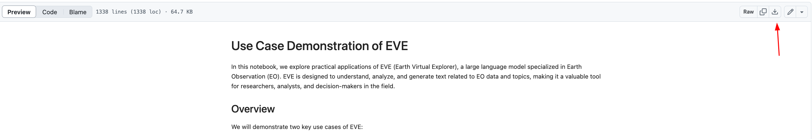
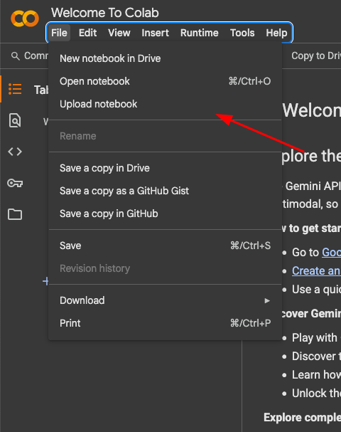
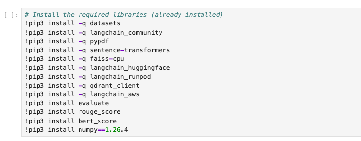
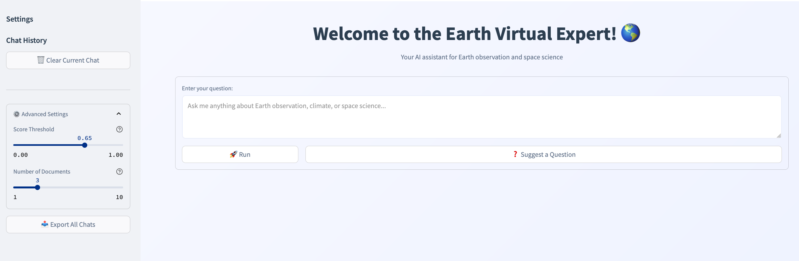

# Living Planet Symposium, EVE workshop 2025

In this notebook, we explore practical applications of [EVE](https://eve.philab.esa.int/) (Earth Virtual Expert), a large language model specialized in Earth Observation (EO). EVE is designed to understand, analyze, and generate text related to EO data and topics, making it a valuable tool for researchers, analysts, and decision-makers in the field.
The repository contains a notebook that can be ran in the provided environment and is self contained. If desired, can be ran in any jupyterlab environment.

# Prerequisites
1. Basic understanding of git
2. Python and jupyter environment knowledge
3. Machine Learning knowledge
4. Basic knowledge of Natural Language Processing (NLP)

# Getting started
1. Navigate to [Login URL](https://workshop-domain-xg0e2thq.auth.eu-west-1.amazoncognito.com/login?client_id=7madi5630laknl4u2qhijiqsjh&response_type=code&scope=aws.cognito.signin.user.admin+openid+profile&redirect_uri=https://7awusuivdb.execute-api.eu-west-1.amazonaws.com/invoke)
2. Log in using the credential provided

3. Once the Studio starts, Click on JupyterLab

4. Click `Create JupyterLab Space`

5. Give it a name. Eg: `Workshop`
6. Once initialized, change Instance type to `ml.p3.2xlarge`, storage to `30` and as Lifecylce `EVE`

7. Click on `Run Space`.
8. If a space is already running, click on "open". This should open a new tab with the jupyterlab environment.

9. Select EVE as a kernel for the notebook:

# Colab fallback
If you're unable to follow the session using the provided environment, you can follow these steps to run the notebook on your personal Colab account:
1. Download the hands-on-notebook from the [repo](https://github.com/eve-esa/lps-workshop/blob/main/eve_use_cases.ipynb):

2. Upload it on your [colab account](https://colab.research.google.com/):

3. Uncomment (by removing '#' characters) and run the requirements cell:

4. Create another cell and run the [code](https://docs.google.com/document/d/1DPKWhcv-PcLUVyvsKr8kM_tQG2cx0rdAr96jHSu4p6k/edit?usp=sharing) to initialize the enviroment variables

# Live demo
Try out our [first version](https://huggingface.co/spaces/eve-esa/eve-demo) of the system on Hugging Face. You'll find a working demo where you can explore some of the features already implemented and interact with a small knowledge base of documents.

# Pilot program
EVE will host a pilot session in **September** where you'll have the opportunity to preview the entire system, explore its features, and evaluate how it could support your work as a researcher, student, or professional in the Earth Observation (EO) field. Your feedback will be essential in guiding the final stages of development and ensuring the system meets the real needs of the community.

**Help us developing EVE!** Register at the following link:

# Acknowledgements
Many thanks to Iksha from the [NASA-IMPACT](https://github.com/NASA-IMPACT) team for the support and guidance during the infrastructure setup.
